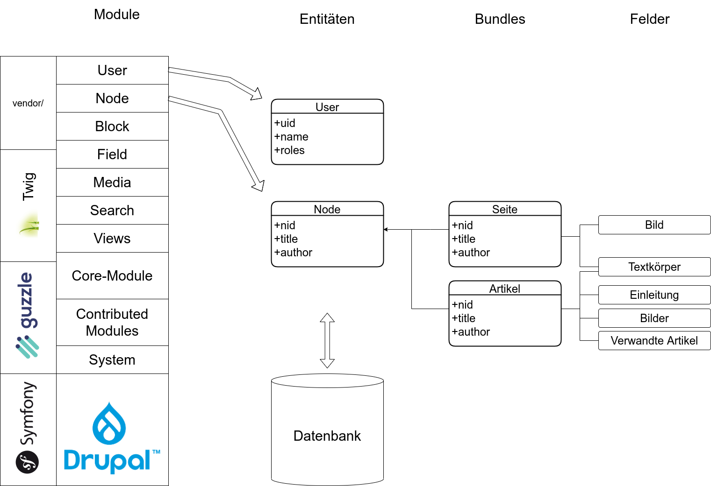

- lat. "seiend", "Ding"
- strukturierte Datenobjekte (Entitäten)
- erweiterbare Datenstruktur (Felder)
- mit Funktionalität verknüpfbar
- einheitliche Repräsentation (intern/extern) durch Abstraktion

## Entitäts-Kategorien

### Configuration Entities

- Speichern Konfiguration

z.B. _Setting_, _View_, _Webform_, _Entity Type_

### Content Entities

- Speichern Inhalte

e.g. _Node_, _User_, _Taxonomy Term_, _Custom Block_

## Entity types

- Definieren Typen von Inhalten

e.g. _Node_, _User_, _File_, _Media Item_

## Properties

- Speichern grundlegende Entitätsinformationen/-einstellungen pro Entitätstyp

z.B. _ID_, _Title_, _Author_, _Language_

## Bundles

- Definieren Untertypen von Inhalts-Entitätstypen
- Manche Entitätstypen haben keins (bzw. nur ein) Bundle (z.B. _User_)

z.B. _Content Types_, _Taxonomy Vocabularies_, _Block Types_

## Fields

- Speichern benutzerdefinierte Entitätsinformationen pro Bundle

### Field Types

- Definieren Typen von Daten, die Felder speichern können
- Wiederverwendbar an jeder Entität eines "fieldable" Entitätstyps

z.B. _Text_, _Long Text_, _Image_, _Media_, _Entity Reference_

### Field Widgets

- Definieren, wie Feldwerte in der Benutzeroberfläche eingegeben werden können

z.B. _Textfield_, _Media Selector_, _Autocomplete_

### Field Formatters

- Definieren, wie Feldwerte dargestellt werden können

z.B. _Formatted Text_, _Image_, _Gallery_, _Entity Preview_

## Display Modes

- Definieren, wie Entitäten in verschiedenen Modi dargestellt werden können

### Form Modes

- Definieren Kombinationen von Feld-Widgets, d.h. Formulartypen für das
  Erstellen/Bearbeiten von Entitäten

z.B. _Edit Form_, _Create Form_

### View Modes

- Definieren Kombinationen von Feld-Formatierern

z.B. _Full_, _Teaser_, _RSS_
